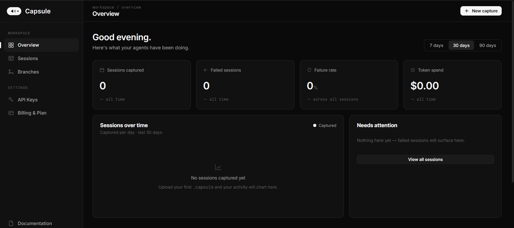

[](https://pypi.org/project/capsule-trace/)
[](https://pypi.org/project/capsule-trace/)
[](LICENSE)
[](https://pypi.org/project/capsule-trace/)
[](https://github.com/capsule-R/capsule/actions/workflows/ci.yml)

# Capsule — Deterministic Replay for AI Agents

**Capture any agent failure. Replay it anywhere. Branch from any step. Share it like a file.**

---

## The problem

When an AI agent fails in production you can't reproduce it. LLM outputs are non-deterministic — run the same code twice and you get two different failures. Every existing observability tool records what happened; none of them let you re-run it. Capsule is the replay button that doesn't exist anywhere else.

---

## How it works

**Step 1 — Install:**

```bash
pip install capsule-trace
```

**Step 2 — Wrap your agent (one decorator):**

```python
import capsule_trace as capsule
from openai import OpenAI

@capsule.trace(agent_name="billing-agent")
def run_agent(customer_id: str):
    client = OpenAI()
    # your existing agent code — nothing else changes
    response = client.chat.completions.create(
        model="gpt-4o",
        messages=[{"role": "user", "content": f"Process refund for {customer_id}"}]
    )
    return response
```

Every LLM call, tool invocation, and memory operation is captured into a `.capsule` file automatically. No API wrappers. No SDK changes.

**Step 3 — Replay any session:**

```bash
capsule-trace replay <session-id>
# No API call made. Exact same output. Every time.
```

---

## Core features

### Cassette replay — offline, no API key required

```bash
capsule-trace replay ses_01HXYZ --mode=cassette
```

Responses are stored verbatim in the `.capsule` archive. Replay works on a plane, in CI, on a colleague's laptop — without an API key or network access.

### Branch from any step

Change the prompt at step 5, re-run from there:

```bash
capsule-trace branch ses_01HXYZ --from-step 5
```

Branches let you explore counterfactuals without re-running expensive upstream steps. Run your agent code against the branch context and live LLM calls resume from that point.

### Export as a portable file — attach to any GitHub issue

```bash
capsule-trace export ses_01HXYZ --output bug-report.capsule
```

A single self-contained file. Drag it into a GitHub issue the same way you attach a screenshot.

### Import and replay on any machine

```bash
capsule-trace replay ./bug-report.capsule
```

No setup. No environment variables. No database. The archive contains everything needed for a full offline replay.

### Upload to your team dashboard

```bash
capsule-trace login
capsule-trace upload ses_01HXYZ
```

Share sessions with your team without sharing API keys. Browse, filter, and replay from the browser.

---

## CLI reference

| Command | Description |
|---|---|
| `capsule-trace list` | List all captured sessions |
| `capsule-trace show <id>` | Inspect a session in detail |
| `capsule-trace replay <id\|file>` | Replay a session (cassette mode by default) |
| `capsule-trace branch <id> --from-step N` | Branch from step N |
| `capsule-trace export <id> --output FILE` | Export as a `.capsule` file |
| `capsule-trace import FILE` | Import a `.capsule` file into the local store |
| `capsule-trace diff <id1> <id2>` | Compare two sessions step-by-step |
| `capsule-trace upload <id>` | Upload to Capsule Cloud |
| `capsule-trace login` | Authenticate with cloud |
| `capsule-trace logout` | Clear saved credentials |

---

## Framework integrations

### OpenAI

Auto-patched on import — no additional setup:

```python
import capsule_trace as capsule
from openai import OpenAI

@capsule.trace(agent_name="openai-agent")
def run(prompt: str):
    client = OpenAI()
    return client.chat.completions.create(
        model="gpt-4o",
        messages=[{"role": "user", "content": prompt}],
    )
```

### Anthropic

Also auto-patched on import:

```python
import capsule_trace as capsule
import anthropic

@capsule.trace(agent_name="claude-agent")
def run(prompt: str):
    client = anthropic.Anthropic()
    return client.messages.create(
        model="claude-opus-4-5",
        max_tokens=1024,
        messages=[{"role": "user", "content": prompt}],
    )
```

### LangChain

Pass `CapsuleCallbackHandler` to any LangChain LLM, chain, or agent:

```python
import capsule_trace as capsule
from langchain_openai import ChatOpenAI
from capsule_trace.integrations.langchain import CapsuleCallbackHandler

@capsule.trace(agent_name="langchain-agent")
def run(prompt: str):
    llm = ChatOpenAI(callbacks=[CapsuleCallbackHandler()])
    return llm.invoke(prompt)
```

### LangGraph

One call wraps every node in the graph:

```python
import capsule_trace as capsule
from langgraph.graph import StateGraph
from capsule_trace.integrations.langgraph import add_capsule_tracing

graph = StateGraph(AgentState)
graph.add_node("llm", call_llm)
graph.add_node("tools", execute_tools)
add_capsule_tracing(graph)  # captures all node executions

@capsule.trace(agent_name="langgraph-agent")
def run():
    app = graph.compile()
    return app.invoke({"messages": [...]})
```

---

## The .capsule format

A `.capsule` file is a zstd-compressed tar archive with a SHA-256 integrity hash. The format is fully open — documented in [`docs/spec/capsule-format-v1.md`](docs/spec/capsule-format-v1.md) — and designed to be readable by any tool that can decompress zstd and parse JSON.

```
my-session.capsule
├── manifest.json      # format version, integrity hash, producer info
├── session.json       # agent metadata, status, step count
├── events/            # every LLM call, tool call, memory op
│   ├── 0001-llm_call.json
│   └── 0002-tool_call.json
├── cassettes/         # stored API responses for offline replay
│   └── <cassette-id>.json
└── snapshots/         # memory and state snapshots per step
    └── step-0001.json
```

zstd compressed. SHA-256 integrity hash. Fully open spec. Import it in any language that handles tar archives.

---

## Cloud platform



Upload capsules to a shared team workspace. Browse, inspect, replay, and branch from the browser. Share a replay link without granting API access.

[capsule-five-delta.vercel.app](https://capsule-five-delta.vercel.app)

---

## Why Capsule vs alternatives

| Tool | Records what happened | Deterministic replay | Portable file | Cross-framework |
|---|---|---|---|---|
| LangSmith | ✅ | ❌ | ❌ | ❌ (LangChain only) |
| AgentOps | ✅ | ❌ | ❌ | ✅ |
| Langfuse | ✅ | ❌ | ❌ | ✅ |
| **Capsule** | ✅ | ✅ | ✅ | ✅ |

Every other tool in this space solves the observability problem. Capsule solves the reproducibility problem. These are different problems.

---

## Installation

**Requirements:** Python 3.11+

```bash
pip install capsule-trace
```

With framework extras:

```bash
pip install "capsule-trace[openai]"
pip install "capsule-trace[anthropic]"
pip install "capsule-trace[langchain]"
pip install "capsule-trace[langgraph]"
pip install "capsule-trace[all]"   # everything
```

Building from source requires a Rust toolchain (for the replay engine). `pip install capsule-trace` does not require Rust.

---

## Contributing

See [CONTRIBUTING.md](CONTRIBUTING.md).

The SDK (`packages/sdk`) and CLI are Apache 2.0. The cloud platform (`packages/cloud-api`, `packages/cloud-web`) is proprietary.

Open issues for bugs. Open PRs for fixes. Keep PRs focused — one thing at a time.

---

## License

The SDK and CLI are licensed under the [Apache License 2.0](LICENSE).

The cloud platform (`packages/cloud-api`, `packages/cloud-web`) is proprietary and not covered by this license.
